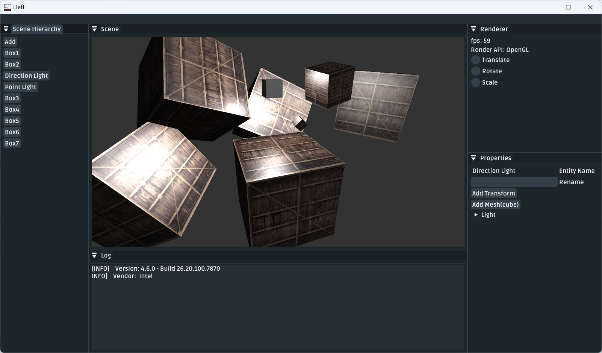

 

# Deft

玩具游戏引擎

## 截图

## TODO

- [x] 数学库
- [x] 简单编辑器
- [x] ECS
- [x] 光照（冯氏光照，Pbr 未完成）
- [ ] 阴影
- [ ] 读取 `.obj` 模型文件
- [ ] 物理碰撞
- [ ] 窗口大小变换
- [ ] 2D 场景
- [ ] 屏幕内物体选择
- [ ] 游戏内 UI 组件
- [ ] 游戏模式
- [ ] 声音系统
- [ ] vulkan 等多平台
- [ ] 脚本支持
- [ ] 网络支持
- [ ] 动画

~~说是 TODO 又不是一定要完成（~~

## 第三方库

- glfw
- glad
- stb_image
- ImGui
- ImGuizmo

## 协议

MIT

## 参考

- [Hazel](https://github.com/TheCherno/Hazel)
- [glm](https://github.com/g-truc/glm)
- [Piccolo](https://github.com/BoomingTech/Piccolo)
